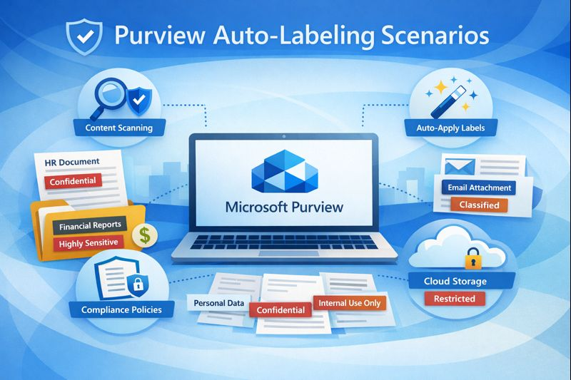

This is an article I've wanted to put together for a while: a comprehensive reference of all the different auto-labeling mechanisms available in Microsoft Purview Sensitivity Labels, organized by platform and location. This includes client-side and service-side auto-labeling, default labels from policies, and specific behaviors in SharePoint, Exchange, Teams, Power BI/Fabric, and hybrid/on-premises scenarios.

Let me know if you see any errors or omissions! This stuff is spread all over the documentation, so it's possible I missed something.

### Primary Auto-Labeling Mechanisms (Organized by Platform/Location)



| Mechanism                                | Location                                            | How It Works                                                                      | Based On                                                                           | Override Manual Labels?       | Override Auto-Applied Lower Priority? | Override Auto-Applied Higher Priority? | Override Default Label from Policy? | Key Notes                                                                                            | Documentation Reference                                                                              |
| ---------------------------------------- | --------------------------------------------------- | --------------------------------------------------------------------------------- | ---------------------------------------------------------------------------------- | ----------------------------- | ------------------------------------- | -------------------------------------- | ----------------------------------- | ---------------------------------------------------------------------------------------------------- | ---------------------------------------------------------------------------------------------------- |
| **Client-Side Auto-Labeling**            | Word, Excel, PowerPoint, Outlook                    | Real-time labeling as users create & edit documents or emails                     | SITs, Trainable Classifiers                                                        | ❌ No                         | ✅ Yes                                | ❌ No                                  | ✅ Yes (if higher priority)         | <ul><li>Can be automatic or recommended</li><li>User can accept/reject</li><li>Minimal delay</li><li>Exception: No action if file has sublabel from same parent when another sublabel from same parent matches</li></ul> | [Configure auto-labeling for Office apps](https://learn.microsoft.com/en-us/purview/apply-sensitivity-label-automatically#how-to-configure-auto-labeling-for-office-apps) |
| **Service-Side Auto-Labeling Policies**  | SharePoint, OneDrive, Exchange Online (in-transit)  | Scans files at rest in SharePoint/OneDrive and emails in transit through Exchange | SITs, Trainable Classifiers, sharing options, file type, size, name, contains text | ❌ No (excluding Exchange) | ✅ Yes                                | ❌ No (excluding Exchange)          | ✅ Yes (if higher priority)         | <ul><li>Can run in simulation mode first</li><li>Exchange has optional "always override" setting</li><li>Additional conditions available per location</li></ul> | [Configure auto-labeling policies for SharePoint, OneDrive, and Exchange](https://learn.microsoft.com/en-us/purview/apply-sensitivity-label-automatically#how-to-configure-auto-labeling-policies-for-sharepoint-onedrive-and-exchange) |
| **Default Label from Publishing Policy** | Word, Excel, PowerPoint, Outlook, Power BI & Fabric | Policy specifies default label for new/unlabeled content when created             | Policy configuration                                                               | ❌ Never                      | ❌ Never                              | ❌ Never                               | N/A                                 | <ul><li>TREATED AS AUTOMATICALLY APPLIED</li><li>Never overrides existing labels</li><li>Only applies to unlabeled content</li><li>Different behavior for files/email vs Power BI</li><li>Not recommended for encrypted labels</li></ul> | [What label policies can do](https://learn.microsoft.com/en-us/purview/sensitivity-labels#what-label-policies-can-do) |





| Mechanism                                         | Location/Platform             | How It Works                                                                               | Based On                         | Override Manual Labels?                      | Override Auto-Applied Lower Priority? | Override Auto-Applied Higher Priority? | Override Default Label from Policy? | Key Notes                                                                                            | Documentation Reference                                                                              |
| ------------------------------------------------- | ----------------------------- | ------------------------------------------------------------------------------------------ | -------------------------------- | -------------------------------------------- | ------------------------------------- | -------------------------------------- | ----------------------------------- | ---------------------------------------------------------------------------------------------------- | ---------------------------------------------------------------------------------------------------- |
| **SharePoint Library Default Label**              | SharePoint document libraries | Location-based labeling applied to new/edited files in specific library                    | Location (no content inspection) | ❌ No                                        | ✅ Yes                                | ❌ No                                  | ✅ Yes (if higher priority)         | <ul><li>Applied at library level</li><li>Takes a few minutes for uploads</li><li>Immediate in Office web</li><li>Files must contain content</li></ul> | [Configure a default sensitivity label for a SharePoint document library](https://learn.microsoft.com/en-us/purview/sensitivity-labels-sharepoint-default-label) |
| **Label-Based Extension to Downloaded Documents** | SharePoint Online             | Document library label extends encryption to downloaded files via user-defined permissions | Site/library label + encryption  | ⚠️ Yes (if existing label does not encrypt) | ⚠️ Yes                               | ⚠️ Yes                                | ⚠️ Yes                             | <ul><li>Replaces labels that do not encrypt</li><li>Does not replace encrypted labels</li><li>Copilot can reference but not summarize files</li></ul> | <https://learn.microsoft.com/en-us/purview/sensitivity-labels-sharepoint-extend-permissions>         |
| **Microsoft Syntex Document Understanding**       | SharePoint document libraries | AI models identify document types and apply configured labels                              | AI model recognition             | ❌ No                                        | ✅ Yes                                | ❌ No                                  | ✅ Yes (if higher priority)         | <ul><li>Model trained to recognize documents</li><li>Label configured in model settings</li><li>Honors label order/priority rules</li><li>Applies to Office files: .docx, .pptx, .xlsx</li></ul> | [Apply a sensitivity label to a model in Microsoft Syntex](https://learn.microsoft.com/en-us/microsoft-365/contentunderstanding/apply-a-sensitivity-label-to-a-model) |





| Mechanism                              | Location/Platform       | How It Works                                                                            | Based On                                        | Override Manual Labels?              | Override Auto-Applied Lower Priority? | Override Auto-Applied Higher Priority? | Override Default Label from Policy? | Key Notes                                                                                            | Documentation Reference                                                                              |
| -------------------------------------- | ----------------------- | --------------------------------------------------------------------------------------- | ----------------------------------------------- | ------------------------------------ | ------------------------------------- | -------------------------------------- | ----------------------------------- | ---------------------------------------------------------------------------------------------------- | ---------------------------------------------------------------------------------------------------- |
| **Email Inheritance from Attachments** | Outlook (all platforms) | Email inherits highest priority label from labeled document attachments                 | Attachment labels                               | ❌ No                                | ✅ Yes                                | ❌ No                                  | ✅ Yes (if higher priority)         | <ul><li>Physical file attachments only (not links)</li><li>Can be automatic or recommended</li><li>Can inherit encryption settings</li><li>Policy setting: "Email inherits highest priority label from attachments"</ul> | [Configure label inheritance from email attachments](https://learn.microsoft.com/en-us/purview/sensitivity-labels-office-apps#configure-label-inheritance-from-email-attachments) |
| **Email Thread Label Inheritance**     | Outlook                 | Label on email automatically applied to subsequent replies in thread                    | Previous email in thread                        | ❌ No                                | ✅ Yes                                | ❌ No                                  | ✅ Yes (if higher priority)         | <ul><li>Automatic on reply/forward</li><li>Appears in Activity Explorer as automatic labeling</li></ul>                 | [Labeling activities - Sensitivity label applied](https://learn.microsoft.com/en-us/purview/data-classification-activity-explorer-available-events#sensitivity-label-applied) |
| **Encryption-Based Label Matching**    | Office apps (documents) | When document has admin-defined encryption without label, Office assigns matching label | Matching encryption policy embedded in document | ⚠️ Can replace non-encrypted labels | ✅ Yes                                | ⚠️ Varies                             | ✅ Yes                              | <ul><li>Helps migrate from rights management templates</li><li>Common with encrypted email attachments</li><li>Works only within tenant</li></ul> | [Encryption-based label matching for documents](https://learn.microsoft.com/en-us/purview/sensitivity-labels-office-apps#encryption-based-label-matching-for-documents) |





| Mechanism                                           | Location / Platform                     | How It Works                                                                                        | Based On             | Override Manual Labels?                        | Override Auto-Applied Lower Priority? | Override Auto-Applied Higher Priority? | Override Default Label from Policy? | Key Notes                                                                                            | Documentation Reference                                                                              |
| --------------------------------------------------- | --------------------------------------- | --------------------------------------------------------------------------------------------------- | -------------------- | ---------------------------------------------- | ------------------------------------- | -------------------------------------- | ----------------------------------- | ---------------------------------------------------------------------------------------------------- | ---------------------------------------------------------------------------------------------------- |
| **Teams Meetings - Inheritance from Meeting Files** | Teams meetings                          | Meeting inherits highest priority label from files shared in meeting (chat, Shared tab, Live share) | Shared file labels   | ❌ No (unless manual label has lower priority) | ✅ Yes                                | ❌ No                                  | ✅ Yes (if higher priority)         | <ul><li>Policy setting: `Apply inheritance between Teams meetings and artifacts`</li><li>Can be automatic or recommended</li><li>Manually applied lower priority can be overridden</li><li>Notification sent to organizer before meeting starts</li></ul> | [Configure sensitivity labels for Teams meetings](https://learn.microsoft.com/en-us/purview/sensitivity-labels-meetings#how-to-configure-a-sensitivity-label-to-protect-calendar-items-teams-meetings-and-chat) |
| **Teams Container File Inheritance**                | Teams-connected SharePoint sites        | Files inherit Team/channel label if unlabeled                                                       | Container label      | ❌ No                                          | ✅ Yes                                | ❌ No                                  | ✅ Yes (if higher priority)         | <ul><li>Standard & private channels</li><li>Container default behavior</li></ul>                                        | <https://learn.microsoft.com/en-us/microsoftteams/sensitivity-labels>                                |
| **Teams Meetings - Default Label from Policy**      | Teams meetings, Outlook calendar events | Default label applied to new meetings and calendar events                                           | Policy configuration | ❌ No                                          | ✅ Yes                                | ❌ No                                  | N/A                                 | <ul><li>Policy setting: `Apply a default label to meetings and calendar events`</li><li>Outlook: Applied to new and updated unlabeled events</li><li>Teams: Applied to new events only, not updated events</li><li>Independent from email default label setting | [Configure sensitivity labels for Teams meetings](https://learn.microsoft.com/en-us/purview/sensitivity-labels-meetings#how-to-configure-a-sensitivity-label-to-protect-calendar-items-teams-meetings-and-chat) |





| Mechanism                                      | Location/Platform        | How It Works                                                                         | Based On             | Override Manual Labels? | Override Auto-Applied Lower Priority? | Override Auto-Applied Higher Priority? | Override Default Label from Policy? | Key Notes                                                                                            | Documentation Reference                                                                              |
| ---------------------------------------------- | ------------------------ | ------------------------------------------------------------------------------------ | -------------------- | ----------------------- | ------------------------------------- | -------------------------------------- | ----------------------------------- | ---------------------------------------------------------------------------------------------------- | ---------------------------------------------------------------------------------------------------- |
| **Power BI - Creation Inheritance**            | Power BI Service         | New reports/dashboards automatically inherit label from parent semantic model/report | Parent item label    | ❌ No                   | ✅ Yes                                | ❌ No                                  | ✅ Yes (if higher priority)         | <ul><li>Automatic on creation</li><li>Won't block creation if label can't be applied</li></ul>                          | [Sensitivity label inheritance upon creation](https://learn.microsoft.com/en-us/fabric/enterprise/powerbi/service-security-sensitivity-label-overview#sensitivity-label-inheritance-upon-creation-of-new-content) |
| **Power BI - Downstream Inheritance**          | Power BI Service         | Label on semantic model/report propagates to downstream content                      | Parent item label    | ❌ Never                | ✅ Yes (never downgrades)             | ❌ Never                               | ✅ Yes (if higher priority)         | <ul><li>Two modes: User Consent or Fully Automated</li><li>Limited to 80 downstream items</li><li>Never replaces with less restrictive label</li><li>Strictly enforces no downgrade rule</li></ul> | [Sensitivity label downstream inheritance](https://learn.microsoft.com/en-us/fabric/governance/service-security-sensitivity-label-downstream-inheritance) |
| **Power BI - Data Source Inheritance**         | Power BI semantic models | Semantic models inherit labels from labeled source data                              | Data source label    | ❌ Never                | ❌ No                                 | ❌ Never                               | ❌ No                               | <ul><li>Sources: Azure Synapse, Azure SQL, Excel on OneDrive/SharePoint</li><li>Most restrictive chosen if multiple sources</li><li>Occurs on connection and refresh</li><li>Desktop: Banner recommends more restrictive label</li></ul> | [Sensitivity label inheritance from data sources](https://learn.microsoft.com/en-us/fabric/governance/service-security-sensitivity-label-inheritance-from-data-sources) |
| **Fabric/Power BI Domain-Level Default Label** | Fabric domains           | Domain admin sets default label for workspaces in their domain                       | Domain configuration | ❌ No                   | ✅ Yes                                | ❌ No                                  | ✅ Yes (if higher priority)         | <ul><li>Applied when items created/updated in domain workspaces</li><li>Follows same override logic as other auto-labeling</li></ul> | [Domain-level default sensitivity labels](https://learn.microsoft.com/en-us/fabric/governance/domain-default-sensitivity-label) |





| Mechanism                          | Location/Platform                                    | How It Works                         | Based On                                       | Override Manual Labels? | Override Auto-Applied Lower Priority? | Override Auto-Applied Higher Priority? | Override Default Label from Policy? | Key Notes                                                                                            | Documentation Reference                                                                              |
| ---------------------------------- | ---------------------------------------------------- | ------------------------------------ | ---------------------------------------------- | ----------------------- | ------------------------------------- | -------------------------------------- | ----------------------------------- | ---------------------------------------------------------------------------------------------------- | ---------------------------------------------------------------------------------------------------- |
| **Information Protection Scanner** | On-premises file shares, SharePoint Server 2013-2019 | Scheduled scans of on-premises files | SITs, Trainable Classifiers, or default labels | ❌ No                   | ✅ Yes                                | ❌ No                                  | ✅ Yes (if higher priority)         | <ul><li>Requires Windows Server + SQL Server</li><li>Discovery or automatic mode</li><li>Can apply default label to all files</li><li>`Treat recommended as automatic` option</li></ul> | [Learn about the information protection scanner](https://learn.microsoft.com/en-us/purview/deploy-scanner) |





| Mechanism                   | Location/Platform                | How It Works                                               | Based On                  | Override Manual Labels? | Override Auto-Applied Lower Priority? | Override Auto-Applied Higher Priority? | Override Default Label from Policy? | Key Notes                                                                                            | Documentation Reference                                                                              |
| --------------------------- | -------------------------------- | ---------------------------------------------------------- | ------------------------- | ----------------------- | ------------------------------------- | -------------------------------------- | ----------------------------------- | ---------------------------------------------------------------------------------------------------- | ---------------------------------------------------------------------------------------------------- |
| **Defender for Cloud Apps** | Cloud apps monitored by Defender | Session policies apply labels through cloud app monitoring | Session policy conditions |                         | ⚠️ Varies                            | ❌ No                                  | ⚠️ Varies                          | <ul><li>Can detect and alert on label changes</li><li>Should be used as a secondary control - Purview is the primary solution for labeling</li></ul> | [Integrate with Microsoft Purview for information protection](https://learn.microsoft.com/en-us/defender-cloud-apps/azip-integration) |



---



| Label Type                                | How Applied                               | Treated As                | Can Be Overridden By Other Auto-Labeling?               | Can Override Other Labels?                  | Documentation Reference                                                                              |
| ----------------------------------------- | ----------------------------------------- | ------------------------- | ------------------------------------------------------- | ------------------------------------------- | ---------------------------------------------------------------------------------------------------- |
| **Default Label from Publishing Policy**  | Applied to unlabeled content when created | **Automatically Applied** | ✅ Yes (by higher priority auto-labeling)               | ❌ Never                                    | [What label policies can do](https://learn.microsoft.com/en-us/purview/sensitivity-labels#what-label-policies-can-do) |
| **Default Label from SharePoint Library** | Applied to files in specific library      | **Automatically Applied** | ✅ Yes (by higher priority or manual)                   | ✅ Yes (lower priority auto/default labels) | [Configure a default sensitivity label for a SharePoint document library](https://learn.microsoft.com/en-us/purview/sensitivity-labels-sharepoint-default-label) |
| **Manually Applied Label**                | User explicitly selects label             | **Manually Applied**      | ❌ Almost Never (except Exchange with explicit setting) | ✅ Yes (with justification if configured)   | [Apply sensitivity labels to your files and email](https://support.microsoft.com/office/apply-sensitivity-labels-to-your-files-and-email-in-office-2f96e7cd-d5a4-403b-8bd7-4cc636bae0f9) |



---



| Rule                                  | Description                                                                                          | Exceptions                                                   | Documentation Reference                                                                              |
| ------------------------------------- | ---------------------------------------------------------------------------------------------------- | ------------------------------------------------------------ | ---------------------------------------------------------------------------------------------------- |
| **Manual Labels are Protected**       | Manually applied labels are almost never overridden by auto-labeling                                 | Exchange service-side policies can be configured to override | [Will an existing label be overridden?](https://learn.microsoft.com/en-us/purview/apply-sensitivity-label-automatically#will-an-existing-label-be-overridden) |
| **Priority/Order Determines Winner**  | Labels have order numbers. Higher priority can replace lower priority through auto-labeling          | Does not apply to manually applied labels                    | [Label priority (order matters)](https://learn.microsoft.com/en-us/purview/sensitivity-labels#label-priority-order-matters) |
| **Default Policy Labels are Passive** | Default labels from publishing policies never override any existing label (manual or automatic)      | None                                                         | [What label policies can do](https://learn.microsoft.com/en-us/purview/sensitivity-labels#what-label-policies-can-do) |
| **No Downgrade in Power BI**          | Power BI downstream inheritance never replaces with less restrictive label                           | None                                                         | [Downstream inheritance considerations](https://learn.microsoft.com/en-us/fabric/governance/service-security-sensitivity-label-downstream-inheritance#considerations-and-limitations) |
| **Sublabel Parent Exception**         | Client-side auto-labeling: If file has sublabel from parent X, and another sublabel from parent X matches, no action taken | Does not apply to service-side auto-labeling                 | [How multiple conditions are evaluated](https://learn.microsoft.com/en-us/purview/apply-sensitivity-label-automatically#how-multiple-conditions-are-evaluated-when-they-apply-to-more-than-one-label) |
| **80-Item Limit**                     | Power BI downstream inheritance limited to 80 items                                                  | If exceeded, no downstream inheritance occurs                | [Downstream inheritance considerations](https://learn.microsoft.com/en-us/fabric/governance/service-security-sensitivity-label-downstream-inheritance#considerations-and-limitations) |



---



| Priority | Label Type                               | Can Be Overridden?                                                 | Documentation Reference                                                                              |
| -------- | ---------------------------------------- | ------------------------------------------------------------------ | ---------------------------------------------------------------------------------------------------- |
| 1        | **Manually Applied**                     | ❌ Almost Never                                                    | [Will an existing label be overridden?](https://learn.microsoft.com/en-us/purview/apply-sensitivity-label-automatically#will-an-existing-label-be-overridden) |
| 2        | **Auto-Applied (High Priority Label)**   | ❌ No (by lower priority) ✅ Yes (by higher priority or manual) | [Label priority (order matters)](https://learn.microsoft.com/en-us/purview/sensitivity-labels#label-priority-order-matters) |
| 3        | **Auto-Applied (Low Priority Label)**    | ✅ Yes (by higher priority or manual)                              | [Label priority (order matters)](https://learn.microsoft.com/en-us/purview/sensitivity-labels#label-priority-order-matters) |
| 4        | **Default Label from Publishing Policy** | ✅ Yes (by any auto-labeling or manual)                            | [What label policies can do](https://learn.microsoft.com/en-us/purview/sensitivity-labels#what-label-policies-can-do) |
| 5        | **Unlabeled**                            | ✅ Yes (by any labeling mechanism)                                 | [Automatically apply a sensitivity label](https://learn.microsoft.com/en-us/purview/apply-sensitivity-label-automatically) |



---



| Activity                       | Event Name                     | Details Captured                                                      | Where to View                                     | Documentation Reference                                                                              |
| ------------------------------ | ------------------------------ | --------------------------------------------------------------------- | ------------------------------------------------- | ---------------------------------------------------------------------------------------------------- |
| **Label Applied**              | Sensitivity label applied      | Source (manual/auto), label name, user, location, timestamp           | Activity Explorer, Audit Log                      | [Labeling activities - Sensitivity label applied](https://learn.microsoft.com/en-us/purview/data-classification-activity-explorer-available-events#sensitivity-label-applied) |
| **Label Changed**              | Sensitivity label changed      | Old label, new label, upgrade/downgrade indicator, justification text | Activity Explorer, Audit Log                      | [Labeling activities - Sensitivity label changed](https://learn.microsoft.com/en-us/purview/data-classification-activity-explorer-available-events#sensitivity-label-changed) |
| **Label Removed**              | Sensitivity label removed      | Previous label, justification (if required), user                     | Activity Explorer, Audit Log                      | [Labeling activities - Sensitivity label removed](https://learn.microsoft.com/en-us/purview/data-classification-activity-explorer-available-events#sensitivity-label-removed) |
| **Library Default Applied**    | Applied sensitivity label file | ActionSourceDetails = 6 (library default), label GUID                 | Audit Log (SharePoint list activities)            | [Monitoring application of library default sensitivity labels](https://learn.microsoft.com/en-us/purview/sensitivity-labels-sharepoint-default-label#monitoring-application-of-library-default-sensitivity-labels) |
| **Auto-Labeling Policy Match** | Various events based on policy | Policy name, rule matched, simulation vs production mode              | Auto-labeling policy interface, Activity Explorer | [Learn about simulation mode](https://learn.microsoft.com/en-us/purview/apply-sensitivity-label-automatically#learn-about-simulation-mode) |
| **Downstream Inheritance**     | Sensitivity label applied      | Inheritance source, affected items                                    | Activity Explorer                                 | [Get started with activity explorer](https://learn.microsoft.com/en-us/purview/data-classification-activity-explorer) |

