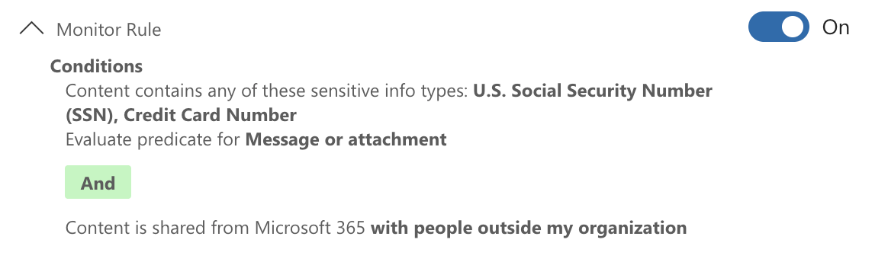
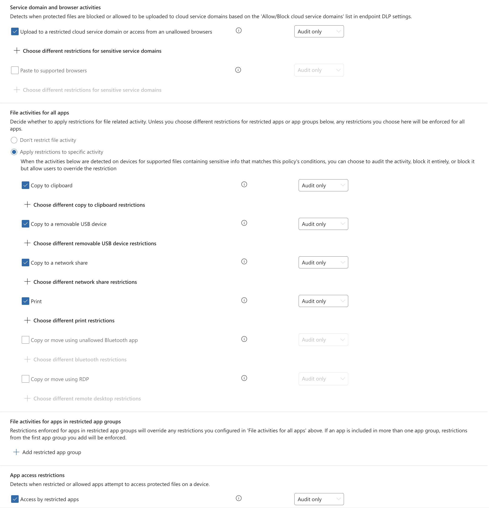
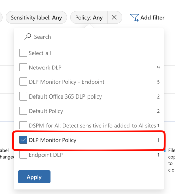
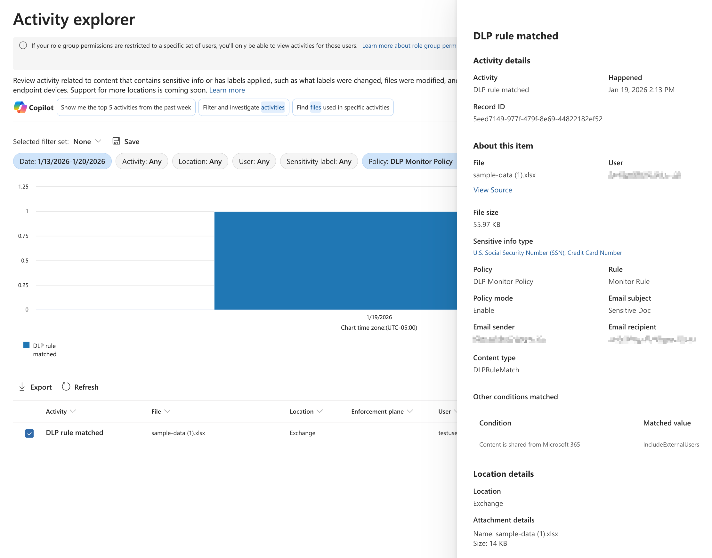

## Why you need a DLP Monitor Policy
While DSPM and the dashboards in Microsoft Purview are getting closer at presenting a holistic view of all sensitive data in transit and at rest, there are still gaps. If you want to accurately monitor data exfiltration, a DLP Monitor Policy is a must-have in your Purview toolkit.

What is a DLP Monitor Policy? Simply put, it's a Data Loss Prevention policy configured to monitor on potential data leaks without actively blocking or restricting user actions. This allows organizations to gain insights into data movement and user behavior without impacting productivity.

For example, you can set up a DLP Monitor Policy to track when sensitive information, such as credit card numbers or personally identifiable information (PII), is shared via email or uploaded to cloud storage services. These actions are logged in Activity Explorer in a sliding 30 day window, providing visibility into potential data exfiltration attempts.

You can also use Monitor policies to assess the impact of DLP controls before implementing them. By monitoring how often certain sensitive data types are accessed or shared, you can make informed decisions about which DLP controls to consider.

### Setting Up a DLP Monitor Policy

1. In Purview DLP, navigate to the **Policies** section and select **Create Policy.**
2. Choose Enterprise applications & devices as the policy type.
3. For templates, choose **Custom Policy** and give it a descriptive name, such as `DLP Monitor Policy`.
4. In the **Locations** section, select all locations where you want to monitor data exfiltration. This typically includes Exchange email, OneDrive, SharePoint, Teams.
    > [!NOTE]
    > If you include Devices, you won't be able to use the **Content is shared from Microsoft 365** condition in your rules. If your monitor policy is for exfiltration, you'll need a separate policy for devices.
5. Create a new rule:
    - Name the rule appropriately, e.g., `Monitor Sensitive Data Exfiltration`.
    - Under **Conditions**, add the **Content contains** condition and target the sensitive information types you want to monitor (e.g., `Credit Card Number`, `Social Security Number`).
    - Add the condition **Content is shared from Microsoft 365**  set to `with people outside my organization` to specifically track data leaving your organization.
    - For **Actions**, leave it empty since this is a monitor policy.
    - Under Incident reports, turn `Sent an alert to admins when a match occurs` to `Off`.
        > [!CAUTION]
        > If you leave this on, you'll get flooded with alerts for every match, defeating the purpose of a monitor policy.
    - Save the rule.
    
6. For **Policy mode**, select `Turn the policy on immediately` to start monitoring right away.
7. Review and create the policy.

#### Endpoint Considerations

For Endpoints, you'll obviously need Endpoint DLP deployed, as well as the Purview Browser Extension deployed for Chrome & Firefox, if those browsers are in use in your organization.

To create a similar monitor policy for endpoints, follow the same steps as above, but in step 4, make sure to select only **Devices** as the location. You'll also need to add the action `Audit or restrict activities on devices` to the rule in step 5, even though it's a monitor policy. This action is required to log activities on endpoints.

For each activity you want to monitor, ensure that they are set to `Audit only` to avoid blocking user actions. Activities such as `Copy to a removable USB device`, `Print`, and `Upload to a restricted cloud service domain` are common choices for monitoring potential data exfiltration on endpoints.

### Monitoring and Analyzing Data Exfiltration

Once your DLP policy has completed synchronization, you can start monitoring data exfiltration activities in the **Activity Explorer** within Purview DLP. Here, you can filter activities based on the sensitive information types you've configured in your monitor policy.

To filter down to your monitor policy, choose **Add filter** and add the **Policy name** filter, then select your policy from the drop-down. 

> [!TIP]
> If your policy doesn't show up in the filter list, it's because it hasn't matched yet. The filter selection list only shows options from what is displayed in the results grid.

To investigate a specific activity, click on it to view detailed information, including the user involved, the locations and the type of sensitive data detected. To view the actual matches and context, click on the blue sensitive info type names under **Sensitive info type** in the details pane.

Activity Explorer is an incredibly powerful tool for analyzing events in Purview. While there can be a lot of noise - especially from Endpoint DLP audit events - with careful filtering and analysis, you can uncover valuable insights into data movement within your organization.
