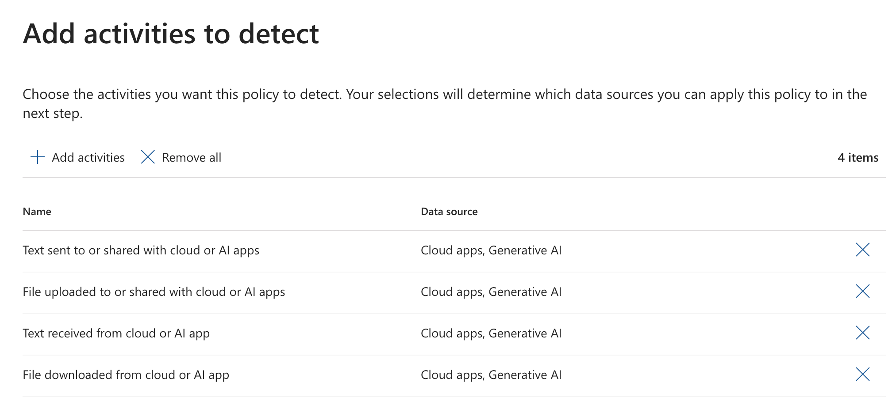
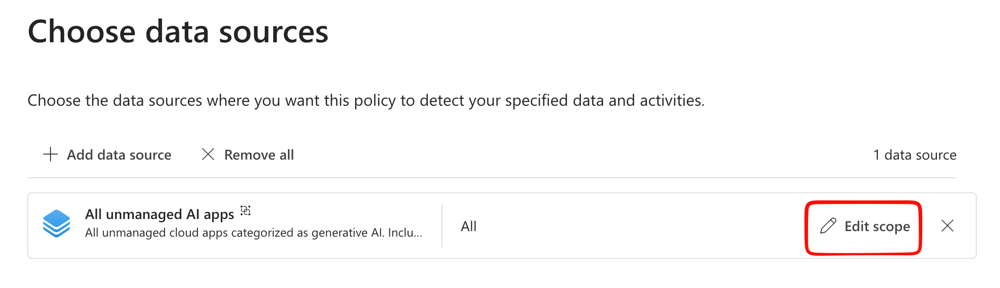
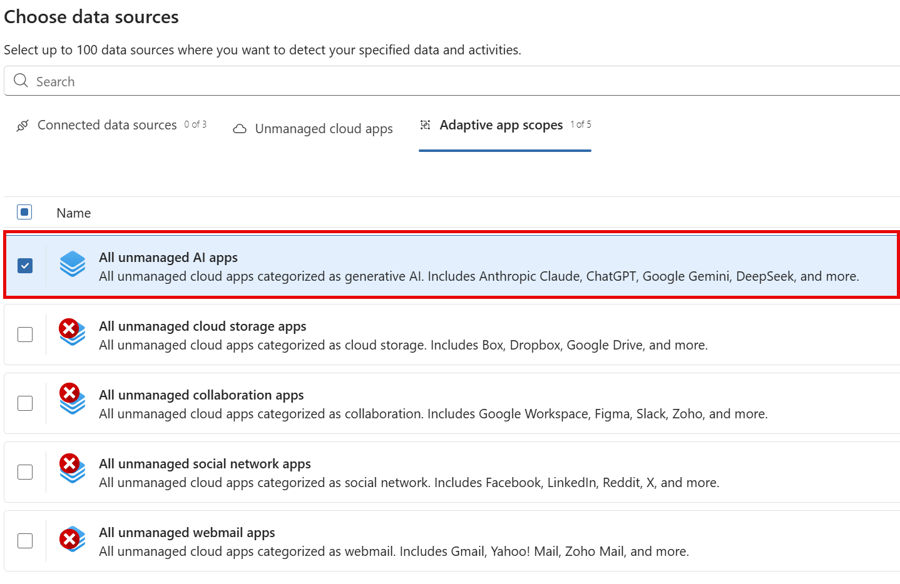

In this blog post, we will explore how to set up and utilize Purview Network Data Loss Prevention (DLP) in conjunction with Global Secure Access (GSA) to safeguard sensitive data as it moves across your network. We will cover the configuration steps, best practices, and real-world scenarios where this integration can enhance your organization's data security posture.

## Prerequisites

- Enterprise Mobility & Security E5 License

GSA is a paid offering. While the M365 traffic profile in GSA is included with E5, to leverage Network DLP capabilities, you will need one of the following licenses that include Entra Internet Access:

- Microsoft Entra Internet Access Standalone License
- Microsoft Entra Suite License

## Global Secure Access (GSA) Setup

The GSA setup is lengthy. We won't cover all of the details here, but you can refer to the official documentation for a comprehensive guide: [Get started with Global Secure Access](https://learn.microsoft.com/en-us/entra/internet-access/get-started-overview).

At a bare minimum, you will need:

- TLS Inspection enabled: [Configure Transport Layer Security inspection settings](https://learn.microsoft.com/en-us/entra/global-secure-access/how-to-transport-layer-security-settings)
- Internet Access Profile created and assigned to users: [Create and manage internet access profiles](https://learn.microsoft.com/en-us/entra/global-secure-access/how-to-manage-internet-access-profile)
- File policy created: [Create a file policy to filter network file content](https://learn.microsoft.com/en-us/entra/global-secure-access/how-to-network-content-filtering)
- Security profile created with file policy linked: [Internet access concepts](https://learn.microsoft.com/en-us/entra/global-secure-access/concept-internet-access#security-profiles)
- Conditional Access policy created to route traffic through GSA and apply the Security profile: [Create a Conditional Access policy to route traffic through Global Secure Access](https://learn.microsoft.com/en-us/entra/global-secure-access/how-to-configure-web-content-filtering#create-and-link-conditional-access-policy)
- Entra joined or hybrid joined device
- GSA client installed, either manually or via Intune: [Install the Global Secure Access Windows client](https://learn.microsoft.com/en-us/entra/global-secure-access/how-to-install-windows-client)
    - QUIC disabled in Edge and Chrome: [Disable QUIC in Microsoft Edge and Chrome with Intune](https://learn.microsoft.com/en-us/entra/global-secure-access/how-to-install-windows-client#disable-quic-in-microsoft-edge-and-chrome-with-intune)
    - DNS over HTTPS (DoH) disabled: [Disable DNS over HTTPS (DoH) with Intune](https://learn.microsoft.com/en-us/entra/global-secure-access/how-to-install-windows-client#disable-quic-in-microsoft-edge-and-chrome-with-intune)
    - IPv4 preferred if using IPv6: [Configure Global Secure Access to prefer IPv4 over IPv6](https://learn.microsoft.com/en-us/entra/global-secure-access/troubleshoot-global-secure-access-client-diagnostics-health-check#ipv4-preferred)

## Purview Network DLP Setup

On the Purview side, there are two main components to Network DLP: Collection Policies and DLP Policies.

### Collection Policies

If you haven't used Collection Polices before, they can be a bit confusing. Collection policies in Microsoft Purview let you filter which events and telemetry are ingested from specific data sources, locations, activities, and content conditions (using classifiers and sensitive info types) so only the signals you need are brought into Purview for classification, auditing, and downstream solutions. They’re scoped to data sources (and combined per source at evaluation), support integrations like SASE/network DLP, and are configured in the Purview portal (Solutions → Data Loss Prevention → Classifiers → Collection policies) to reduce noise and meet regional or regulatory requirements.

In the context of Network DLP (and Edge in-browser protections), collection policies enable the collection of sensitive data sent to the following sources:

- Unmanaged cloud apps
- Adaptive App Scopes, albeit only the `All unmanaged AI apps` scopes

Additionally, you can capture the full text of prompts and responses sent to consumer AI services like Gemini, ChatGTP and Deepseek.

#### Creating a Network DLP Collection Policy

In DLP, navigate to Classifiers → Collection policies and create a new policy:

| Setting | Value |
|---------|-------|
| Name    | Network DLP Collection Policy |
| Description | Collection policy to capture sensitive data in transit via Global Secure Access |
| Data to Detect | `All Classifiers` |
| Activities to Detect | <ul><li>`Text sent to or shared with cloud or AI app`</li><li>`File uploaded to or shared with cloud or AI app`</li><li>`Text received from cloud or AI app`</li><li>`File downloaded from cloud or AI app`</li></ul>  |
| Data Sources | Adaptive App Scope: `All unmanaged AI Apps`  *Currently the only supported scope supported for Browser & Network* Choose Edit Scope to include or Exclude users/groups|
| Where to Apply | <ul><li>Content Capture: Choose `Capture content`</li><li>Cloud apps detection: Choose `Network`</li></ul> |

https://learn.microsoft.com/en-us/purview/collection-policies-policy-reference#data-sources