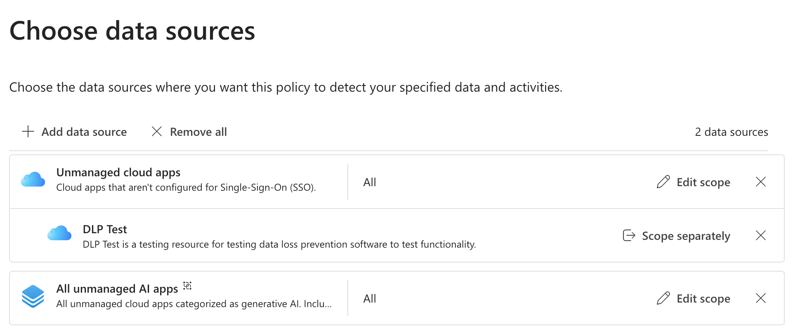
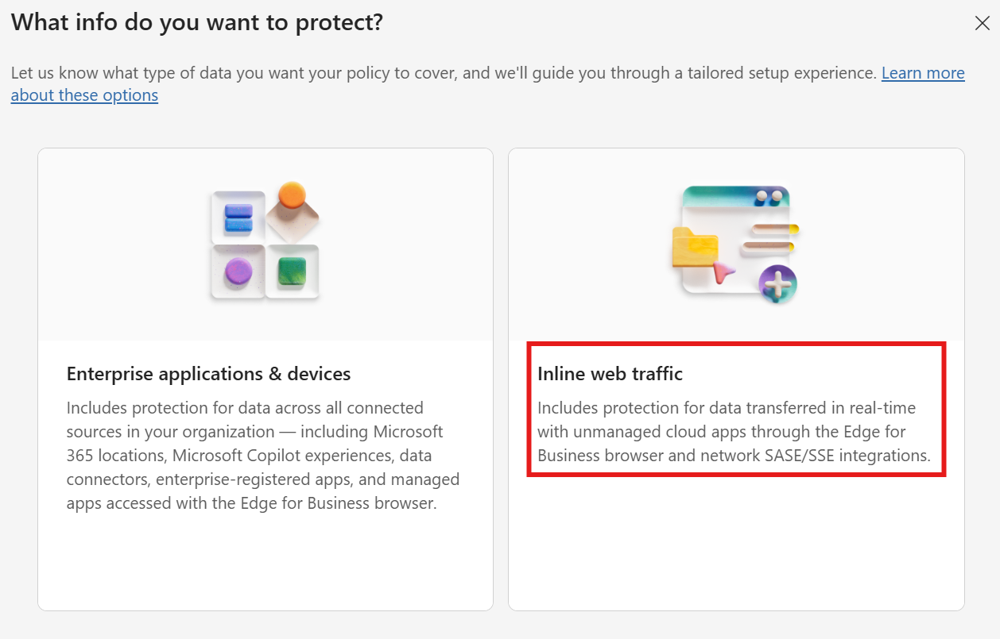
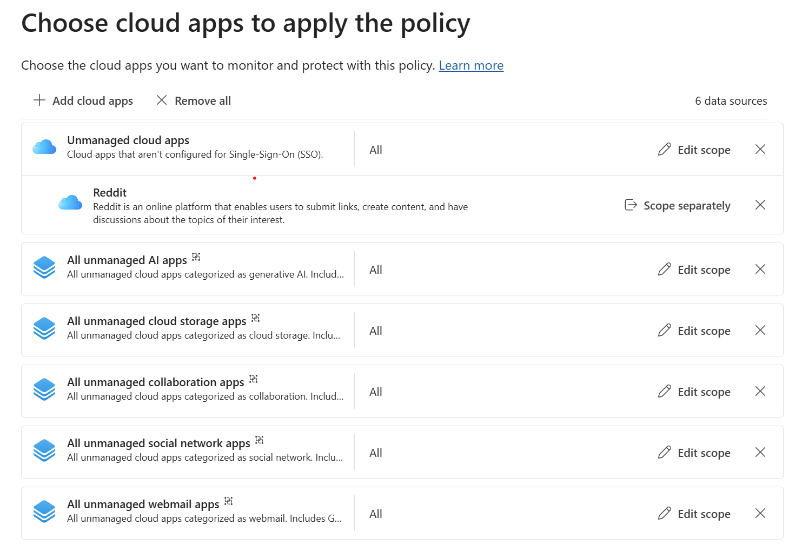
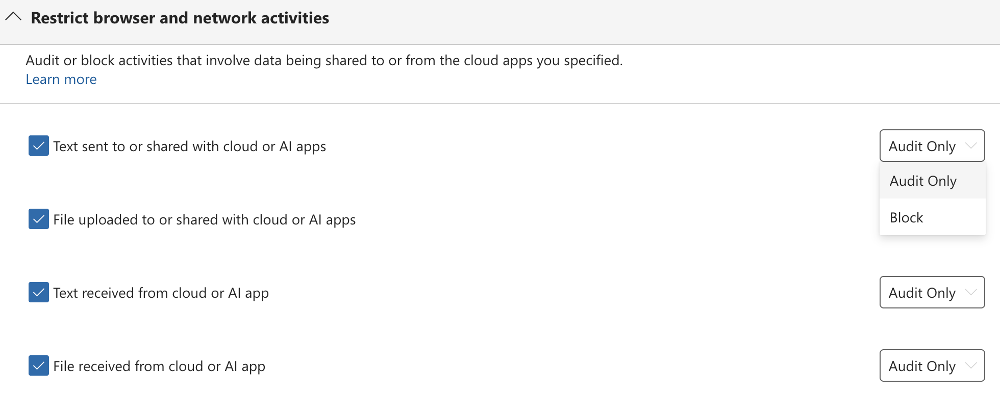
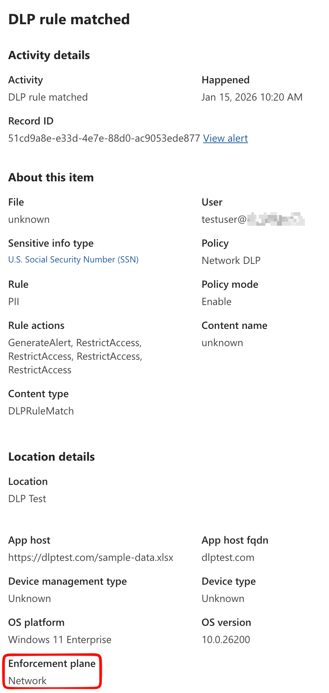

In this blog post and accompanying video, I will explore how to set up and utilize Purview Network Data Loss Prevention (DLP) in conjunction with Global Secure Access (GSA) to safeguard sensitive data as it moves across your network. I'll cover the configuration steps, best practices, and real-world scenarios where this integration can enhance your organization's data security posture.



## Prerequisites

- Enterprise Mobility & Security E5 License for the Purview capability
- Microsoft Entra Internet Access license for GSA

GSA is a paid offering. While the M365 traffic profile in GSA is included with E5, to leverage Network DLP capabilities, you will need one of the following licenses that include Entra Internet Access:

- Microsoft Entra Internet Access Standalone License
- Microsoft Entra Suite License

As always, M365 Maps is your friend when it comes to license verification: [Entra Suite Components](https://m365maps.com/files/Entra-Suite.htm).

## Global Secure Access (GSA) Setup

The GSA setup is lengthy. I won't cover all of the details here, but you can refer to the official documentation for a comprehensive guide: [Get started with Global Secure Access](https://learn.microsoft.com/en-us/entra/internet-access/get-started-overview).

At a bare minimum, you will need:

- TLS Inspection enabled: [Configure Transport Layer Security inspection settings](https://learn.microsoft.com/en-us/entra/global-secure-access/how-to-transport-layer-security-settings)
- Internet Access Profile created and assigned to users: [Create and manage internet access profiles](https://learn.microsoft.com/en-us/entra/global-secure-access/how-to-manage-internet-access-profile)
- File policy created: [Create a file policy to filter network file content](https://learn.microsoft.com/en-us/entra/global-secure-access/how-to-network-content-filtering)
- Security profile created with file policy linked: [Internet access concepts](https://learn.microsoft.com/en-us/entra/global-secure-access/concept-internet-access#security-profiles)
- Conditional Access policy created to route traffic through GSA and apply the Security profile: [Create a Conditional Access policy to route traffic through Global Secure Access](https://learn.microsoft.com/en-us/entra/global-secure-access/how-to-configure-web-content-filtering#create-and-link-conditional-access-policy)
- Entra joined or hybrid joined device
- GSA client installed, either manually or via Intune: [Install the Global Secure Access Windows client](https://learn.microsoft.com/en-us/entra/global-secure-access/how-to-install-windows-client)
    - QUIC disabled in Edge and Chrome: [Disable QUIC in Microsoft Edge and Chrome with Intune](https://learn.microsoft.com/en-us/entra/global-secure-access/how-to-install-windows-client#disable-quic-in-microsoft-edge-and-chrome-with-intune)
    - DNS over HTTPS (DoH) disabled: [Disable DNS over HTTPS (DoH) with Intune](https://learn.microsoft.com/en-us/entra/global-secure-access/how-to-install-windows-client#disable-quic-in-microsoft-edge-and-chrome-with-intune)
    - IPv4 preferred if using IPv6: [Configure Global Secure Access to prefer IPv4 over IPv6](https://learn.microsoft.com/en-us/entra/global-secure-access/troubleshoot-global-secure-access-client-diagnostics-health-check#ipv4-preferred)

## Purview Network DLP Setup

On the Purview side, there are two main capabilities that are enabled when you integrate GSA & Purview: Collection Policies and DLP Policies. Each can be used independently, but they also complement each other well.

### Collection Policies

If you haven't used Collection Polices before, they can be a bit confusing. Collection policies in Microsoft Purview have two main purposes:

- Limiting events and telemetry ingested from specific data sources, locations, activities, and content conditions to reduce noise and meet regional or regulatory requirements. A prime example is Audit data from Endpoint DLP
- Enabling the collection of full content for specific data sources and activities, particularly with Network and Edge in-browser protections.

In the context of Network DLP (and Edge in-browser protections), collection policies enable the collection of sensitive data sent to the following sources:

- Unmanaged cloud apps
- Adaptive App Scopes, albeit only the `All unmanaged AI apps` scopes

Additionally, you can capture the full text of prompts and responses sent to consumer AI services like Gemini, ChatGTP and Deepseek.

#### Creating a Network DLP Collection Policy

In DLP, navigate to Classifiers → Collection policies and create a new policy:

| Setting                                                                                              | Value                                                                                                |
| ---------------------------------------------------------------------------------------------------- | ---------------------------------------------------------------------------------------------------- |
| Name                                                                                                 | Network DLP Collection Policy                                                                        |
| Description                                                                                          | Collection policy to capture sensitive data in transit via Global Secure Access                      |
| Data to Detect                                                                                       | `All Classifiers`                                                                                    |
| Activities to Detect                                                                                 | <ul><li>`Text sent to or shared with cloud or AI app`</li><li>`File uploaded to or shared with cloud or AI app`</li><li>`Text received from cloud or AI app`</li><li>`File downloaded from cloud or AI app`</li></ul>  |
| Data Sources [Reference](https://learn.microsoft.com/en-us/purview/collection-policies-policy-reference#data-sources) | Unmanaged Cloud Apps: `Individual Cloud Apps` Adaptive App Scope: `All unmanaged AI Apps`  *Currently the only supported scope supported for Browser & Network* Choose Edit Scope to include or Exclude users/groups |
| Where to Apply                                                                                       | <ul><li>Content Capture: Choose `Capture content`</li><li>Cloud apps detection: Choose `Network`</li></ul> |

Once created, you should start seeing events populate in Activity Explorer, either in DSPM for AI (classic) or DSPM (preview).

### Network DLP Policies

DLP Policies that target Network are created using the new **Inline Web Traffic** option in the wizard. This a fork in the road from a policy standpoint - the two types of policies cannot be combined.

> [!NOTE]
> As you may have guessed, you cannot edit an existing policy to add Network as a location; it must be created from scratch.

> [!CAUTION]
> Network DLP inspection is a **pay-as-you-go** feature and NOT included in E5. It is billed based on number of requests. Currently, that price is $0.50/10K Requests. For more details, see [Microsoft Purview pricing](https://azure.microsoft.com/en-us/pricing/details/purview/).

#### Creating a Network DLP Policy

In DLP, navigate to Policies and create a new policy:

| Setting                                    | Value                                                                                                |
| ------------------------------------------ | ---------------------------------------------------------------------------------------------------- |
| What type of policy do you want to create? | Choose `Inline web traffic`                                                                          |
| Template                                   | `Custom Policy`  *Currently there are no templates available*                                     |
| Name                                       | Network DLP Policy                                                                                   |
| Description                                | DLP policy to protect sensitive data in transit via Global Secure Access                             |
| Cloud Apps                                 | Unmanaged Cloud Apps: `Individual Cloud Apps` Adaptive App Scope: Choose any combination of app scopes |
| Cloud Apps Scoping                         | Choose Edit Scope to include or Exclude users/groups, or leave at the default, `All`  |
| Enforcement Options                        | Choose `Network`                                                                                     |

After completing those steps, you'll be presented with the familiar DLP policy rule builder. From here, you can configure the policy rules as you would for any other DLP policy. 

##### Conditions

For conditions, Network DLP supports the typical content inspection and file metadata properties.

- Content contains (sensitive info types, sensitivity labels, trainable classifiers)
- Content not fully scanned
- File cannot be scanned
- File extension is
- File is not labeled
- File is password protected
- File size equals or is greater than
- File type is
- Insider risk level for Adaptive Protection is

##### Actions

The only action available is `Restrict browser and network activities`, which allows audit or block for the following activities:

- Text sent to or shared with cloud or AI apps
- File uploaded to or shared with cloud or AI apps
- Text received from cloud or AI apps
- File received from cloud or AI apps

#### Testing Network DLP

To test Network DLP, ensure you have the GSA client installed and configured on your test device. Then, attempt to upload or share sensitive data that matches the conditions defined in your DLP policy using an unmanaged cloud app. If the policy is configured to block, you should see a block page indicating that the action has been blocked.

> [!TIP]
> Because GSA is performing TLS inspection, instead of the typical certificate error you might see when intercepting HTTPS traffic, GSA will present its own block page. So you have that going for you ... which is nice.

Looking at a match in Activity Explorer, you can see the the Enforcement Plane is listed as Network, confirming that the event was captured via Network DLP. In my example below, I targeted the "cloud app" DLP Test, and attempted to download a file containing a credit card number. The DLP policy blocked the download, and the event was logged in Purview.

## Conclusion

Integrating Purview Network DLP with Global Secure Access provides a robust solution for protecting sensitive data in transit across your network. Since you're operating at the network level, you can effectively control data egress from desktop apps and APIs, instead of just the typical egress point of Web Browsers.

Network is still a relatively new capability in Purview DLP, so expect to see additional features and enhancements over time. It's just one part of a comprehensive data protection strategy, but when combined with endpoint DLP, information protection, and other security measures, it can significantly bolster your organization's defenses against data loss.
